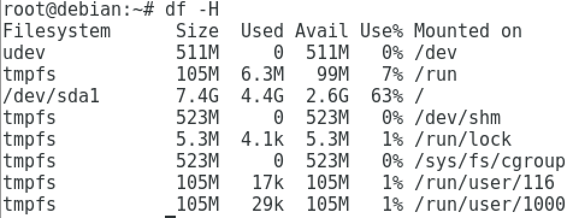
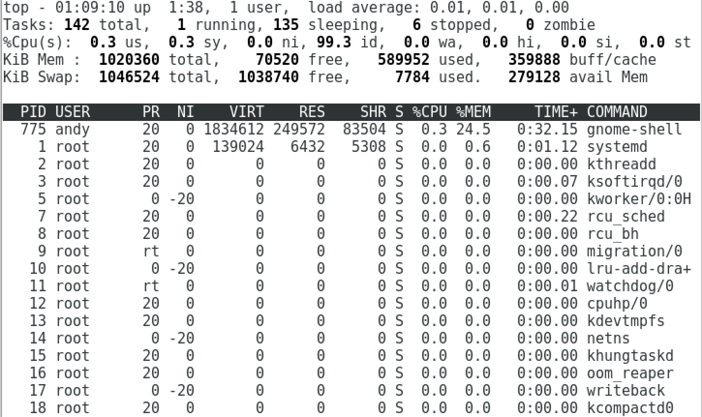
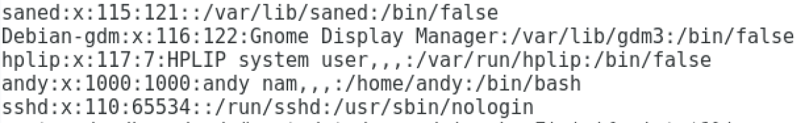

# INIT

## NETWORK

1. Get the list of the network interfaces of the machine without displaying any detail for these interfaces. Only the list of names.
 -  [network interface](https://docs.oracle.com/javase/tutorial/networking/nifs/definition.html) is the point of interconnection between a computer and a private or public network. A network interface is generally a network interface card (NIC), but does not have to have a physical form. Instead, the network interface can be implemented in software.
 -  The  **ifconfig** ifconfig utility is used to assign an address to a network interface and/or configure network interface parameters.
 -  `ifconfig -l` is just get the list of network interfaces.

2. Identify and display the Ethernet interface characteristics: 
 -   standard ethernet is shown as `en` 
	 -  en0 for **wired** Network interface
	 -  en1 for **wireless** Network interface
 -  Identify broadcast address
	 - broadcast : networking to every machine connected by local lan.
	 - so, It can be found in local(wired) ethernet interface(en 0).
	 - `ifconfig en0` 
	 -  or for only to show exact broadcast address, then concat `| grep broadcast | awk '{print $6}'`
 -  Identify all IP adresses which are part of the same subnet
	 -  find the all IP which using same Network, for example we use same wifi(wireless network), then we can see whole machine's address.
	 -  also, we can see the broadcast host
	 -  `arp -a`
	 -  The **arp** utility displays and modifies the Internet-to-Ethernet address
     translation tables used by the address resolution protocol (arp(4)).  With
     no flags, the program displays the current ARP entry for hostname.  The
     host may be specified by name or by number, using Internet dot notation.
     
3. Identify the MAC address of the Wi-Fi card
	- Wifi card can find in wireless ethernet interface
	- `ifconfig en1 ether` include that value.
	- to get an exact answer then `ifconfig en1 | grep ether | awk '{print $2}'` 

4. Identifiy the default gateway in the routing table
 - A **gateway** is a piece of networking hardware used in telecommunications for telecommunications networks that allows data to flow from one discrete network to another.
 - That is to say,  It is the entrance for getting into different network.
 - we can find the routing table in command `netstat -r`
 - **routing table** is used for changing the route. It change the route when computer network try to get the end point.
 - default one is the first one but, to get an exact value `netstat -nr | grep en0 | grep default | awk '{print $2}'`  would be better.

5. Identify the IP address of the DNS that responds to the following url: slash16.org
 - Nslookup is a program to query Internet domain name servers.
 - It has two mode, interactive and non-interactive mode.
 - In this case we have a host dns, so we can just put host after nslookup
 - `nslookup slash16.org`
6. Get the complete path of the file that contains the IP address of the DNS server you’re using
 - whenever DHCP activate network interface, then the file /etc/resolve.conf is automatically made by DHCP client program which contains DNS server.
 -  `/etc/resolve.conf` file has that file.
7. Query an external DNS server on the slash16.org domain name (ie. : google 8.8.8.8)
 - host [server] -> Look up information for host using the current default server or using server, if specified.
 - `nslookup slash16.org 8.8.8.8`
8. Find the provider of slash16.
 - To look for provider of DNS, first need to get an IP address by using `host DNS` or `nslookup DNS`
 - so using that IP, we can find provider in `whois IP` command
 - thoes all Ip address's information shows me the provider is `Amazon.com, Inc.`

9. Find the external IP of 42.fr
 - To look for provider of DNS, first need to get an IP address by using `host DNS` or `nslookup DNS`
 - `nslookup 42.fr | grep Address | awk 'FNR > 1'`
 - `host 42.fr | awk 'FNR < 4 {print $4}'`
 - both thing gives me same answer.
```
163.172.250.11
163.172.250.12
163.172.250.13
```

10. Identify the network devices between your computer and the slash16.org domain
 - Internet is connected a lot of network through the gateway
 - And we can track the route from my server to some Domain using `traceroute` command.
 - `traceroute slash16.org` command show me the whole path from my server to DNS's Ip address.
11. Use the output of the previous command to find the name and IP address of the device that makes the link between you (local network) and the outside world
 - `10.10.254.254`
 - when we see the result of “traceroute slash16.org”, it start from our device and end with slash16.org’s address
 - line 1 is the local IP adress, then line 2 is the NAT router who's remaping the local IP to a public IP pointing to dc3, the host of our public IP..
- 1 : Local IP
- 2 : NAT IP
- 3 : Public IP
12. Find the IP that was assigned to you by dhcp server
 - with easy, we can find in `ifconfig` command
 - `ifconfig en0 | grep "inet " | awk '{print $2}'`
13. Thanks to the previous question and the reverse DNS find the name of your host
 - I got IP addr `10.112.6.10` and. also know how to find the host name by using my IP addr
 - `nslookup 10.112.6.10 | grep "name" | awk '{print $4}'`
 - then i can get `e1z2r6p10.42.us.org.` as host name.
14. What file contains the local DNS entries?
 - system configuration folder of any Unix system, then in hosts.
 - `/etc/hosts`
15. Make the intra.42.fr address reroute to 46.19.122.85
 - to do so, we need to modify `/etc/hosts` file
 - make  `45.19.122.85	  intra.42.fr` things in that file.

--- 

## SYSTEM
> In debian, it is based on the unix. so every command is based on **UNIX** system.
### UNIX
Basically, unix is based on the file system. Everything is stored as File. When we open document, It treat as File descriptor which is type integer. We can handle thoes things whith just that intt.

---

1. In what file can you find the installed version of your Debian?
 - a lot of files is located in `/etc` which is my system configuration folder about my system related information.
 - Search for system configuration folder of Unix system, then for debian_version.
 - `/etc/debian_version`
 - 

2. What command can you use to rename your system?
 - `hostname <name - that i want to rename>`
 - 
 - or also can use `machine.old.name.local`

3. What file has to be modified to make it permanent?
 - Likewise number 1, need to change my system configuration file in `/etc` folder
 - change the `hostname`file's debian into `name` that i want to change, save and restart.
 - 

4. What command gives you the time since your system was last booted?
 - `who -b` command hast the time when the system booted
 - 

5. Name the command that determines the state of the SSH service.
 - `systemctl status ssh` show the current state of the SSH
 - 

6. Name the command that reboots the SSH service.
 - `systemctl restart ssh` is used when there is some change related with SSH
 - afterthen, we need to call `systemctl status ssh` to check the time, when ssh server has started.
 - *need pictur!*

7. Figure out the PID of the SSHD service.
 
 - to get the related with SSHD information, `systemctl status ssh` command is needed.
 - and to get a exact PID pipe the command `|grep " PID" | awk '{print $3}'`
 - root 22405 0.0 0.0 66224 1184 ? Ss 17:46 0:00 /usr/sbin/sshd

8. What file contains the RSA keys of systems that are authorized to connect via SSH?
 - It is stored in the file called `authorized_keys` which is located in the .ssh folder
 - `cat ~/.ssh/authorized_keys` command show me the RSA key
 

9. What command lets you know who is connected to the System?
 - command `w` shows me them.
 

10. Name the command that lists the partition tables of drives?
 - command `lsblk` show.


11. Name the command that displays the available space left and used on the system in an humanly understandable way
 - `df -H`
 - 
 -  `-H` command translate computer byte into human understandable form
 -  

12. Figure out the exact size of each folder of /var in a humanly understandable way followed by the path of it.
 - `du` command is Disk Usage's abbr;
 - `-sh` also change computer byte into human understandable form
 - `du - sh /var/*`
 - 

13. Name the command that find, in real time, currently running processes
 - it also used in mac
 - `top`
 - 

14. Run the ‘tail -f /var/log/syslog‘ command in background
 - to make command run in background, append `&` at the end of command
 - `tail -f /var/log/syslog &` and we can check in command `bg` and `jobs`
 - `bg` tell us how many works running in background
 - `jobs` tell us deatiled works.


15. Find the command that kills the background command’s process
 - by using the command `ps`, we can get a PID which running in the background.
 - `kill` command terminate the background process.


16. Find the service which makes it possible to run specific tasks following a regular schedule
 - [crontab](https://opensource.com/article/17/11/how-use-cron-linux) is used for scheduling some work.
 - It setting the time and work, and work in exact time that we requested.
 - `crontab -e` command can put work manually.
 - as soon as we save them, we can get a message `installing new crontab`.
 - now it's done and will be done at that exact time.


17. Find the command that allows you to connect via ssh on the VM.(In parallel with the graphic session)
 - via `ssh ID@ADDRESS`, we can connect VM through our device. 


	> In this case, sadly, I don't know the password. But It shows me there was a **trial** to connect on that VM machine, debian.

18. Find the command that kills ssh service
 - `stop ssh` cammand kill the ssh server with easy.
 

19. List all services which are started at boot time and name this kind of services
 - `systemctl list-unit-files --type=service` shows me an every service 
 -  piping this command `| grep "enabled"`, we can get exact **started** service and now it is in status "enabled".
 -   `| awk -F'.service' '{print $1}'`, this just showing the name of service


20. List all existing users on the VM
 - as like other question, we can find that information in our system configuration folder.
 - with name `passwd`


21. List all real users on the VM
 - among the existing users, the real one's directroy start from `/home`


22. Find the command that add a new local user
 - `adduser` command can add a new user with easy.
 - type name and just follow the instruction. 


23. Explain how connect yourself as new user. (With graphic session and ssh session)
 - Graphical : When we boot the system, put your login and password when asked
 - SSH : on our another device, type `ssh USER@IP` in the terminal, then put password when asked

24. Find the command that list all packages . Get the list of the network interfaces of the machine without displaying any detail for these interfaces. Only the list of names.
 - [APT](https://www.computerhope.com/unix/apt-get.htm) is a advanced packaging tool for unix system like gem in ruby, pip in python, npm in javascript.
 - `apt-get install`  is command for installing the package
 - `apt installed` is command for getting a list of installed package,

 - If i piping this command `| awk '{print $1}'`, then we can get just name without messy things.
 
## SCRIPTING
1. Write a script which displays only the login, UID and Path of each entry of the /etc/passwd file.
 - the original form is looks like this
 - 
 - so among them, set a delimeter ':' by using `awk -F` command
 - get the login(1), UID(3), and path(7) with `'{print $1 $3 $7}'`


2. Write a script which delete an ACTIVE user on the VM. 
 - 
 - b/c we have another user on here, that we added before.
 - so, put thoes name on my script as argument
 - 
 - First, It need to kill the process that this user using now.
 - after then, we delete this user useing `userdel` command
 - now we have only only one user
 - 

3. Three’s a Charm. Write a script of you choice.
 - The goal is to make run some things on background and showing a name and PID to kill or do something with easy
 - 
```
PID=${ps $FILE | awk '{$1}'}
```

